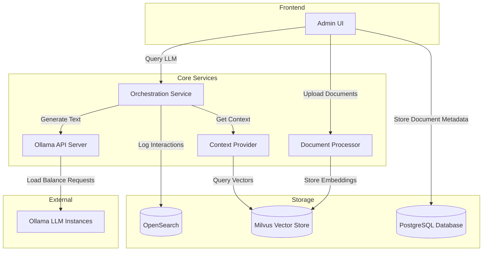
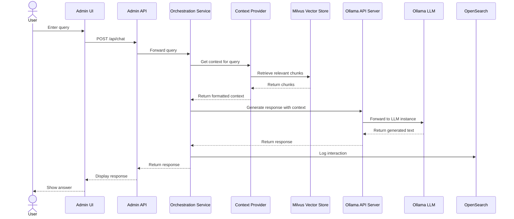

# TN State Chatbot

A  Retrieval-Augmented Generation (RAG) system with document management, query orchestration, and administrative UI.

## Architecture Overview

This system implements a microservices architecture for a scalable RAG pipeline:



---



### Key Components:

- **Admin UI**: Next.js dashboard for document management and chat interface
- **Document Processor**: Handles document parsing, chunking, and embedding
- **Context Provider**: Retrieves relevant document chunks for queries
- **Ollama API Server**: Load balancer for LLM inference
- **Orchestration Service**: Coordinates the entire RAG workflow

### Key Features:

- Document upload and management
- Vector embeddings via Milvus
- Context-aware query processing
- Interaction logging and analytics
- Load balancing for LLM instances

## Getting Started

The simplest way to deploy the entire system is using Docker Compose:

Pull the repository:

```bash
git pull https://github.com/Caleb-Neal-Smith/TN-State-Chatbot
```

```bash
docker-compose up -d
```
