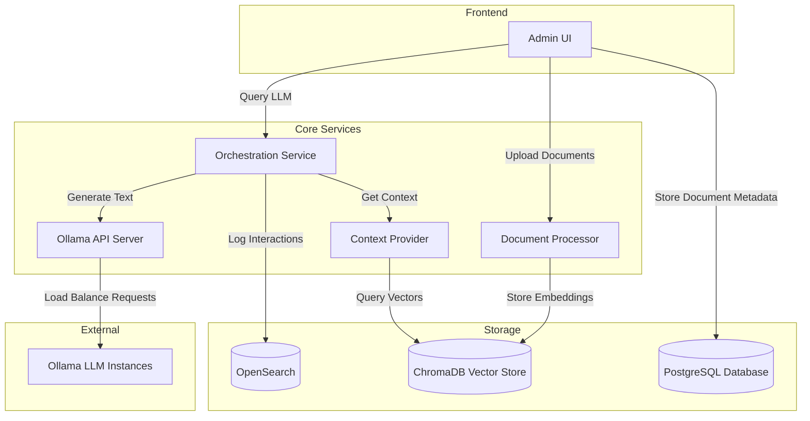

```mermaid
graph TD
    subgraph "Frontend"
        AdminUI[Admin UI]
    end

    subgraph "Core Services"
        OrchestrService[Orchestration Service]
        DocProcessor[Document Processor]
        ContextProvider[Context Provider]
        OllamaAPI[Ollama API Server]
    end

    subgraph "Storage"
        OpenSearch[(OpenSearch)]
        ChromaDB[(ChromaDB Vector Store)]
        PostgreSQL[(PostgreSQL Database)]
    end

    subgraph "External"
        Ollama[Ollama LLM Instances]
    end

    AdminUI -->|Upload Documents| DocProcessor
    AdminUI -->|Query LLM| OrchestrService
    
    OrchestrService -->|Get Context| ContextProvider
    OrchestrService -->|Generate Text| OllamaAPI
    OrchestrService -->|Log Interactions| OpenSearch
    
    ContextProvider -->|Query Vectors| ChromaDB
    
    DocProcessor -->|Store Embeddings| ChromaDB
    
    OllamaAPI -->|Load Balance Requests| Ollama
    
    AdminUI -->|Store Document Metadata| PostgreSQL
```